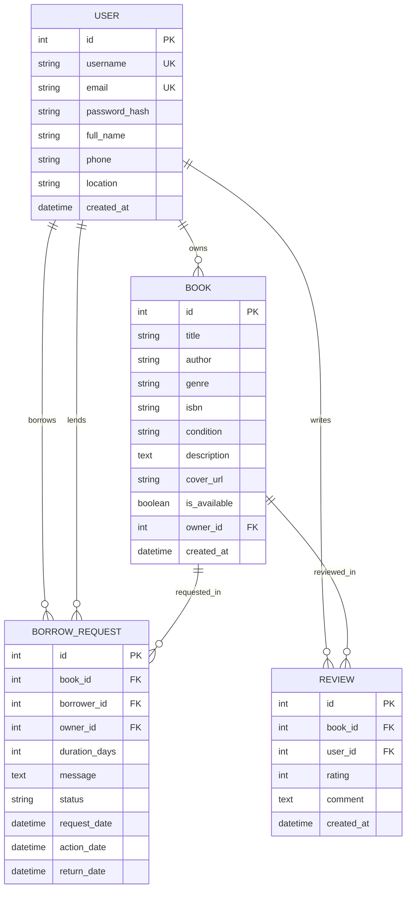

# 📚 BookShare - Community Book Exchange

> **Semester Mini-Project**: A full-stack Python web application enabling peer-to-peer book sharing, lending, and borrowing for college campuses and reading communities.

---

## 🌟 Key Features

1. **User Authentication & Profile System**:
   - Secure registration, login, and logout using salted password hashing (`werkzeug.security`).
   - Profile management with contact info, campus pickup locations, and personal shared bookshelf.

2. **Book Catalog & Inventory Management**:
   - Add, edit, and remove book listings.
   - Specify title, author, genre, condition (*Like New*, *Good*, *Fair*), ISBN, description, and cover image.
   - Live availability tracking (*Available* vs *Borrowed*).

3. **Multi-Criteria Search & Filtering**:
   - Search across titles, authors, and descriptions.
   - Filter by Genre, Physical Condition, and Availability status.

4. **Exchange & Borrowing Lifecycle Workflow**:
   - Community members can submit borrow requests with requested duration (7, 14, 21, 30 days) and pickup meetup notes.
   - Book owners can review incoming requests and **Approve** or **Decline**.
   - Automatic conflict resolution: Approving a request marks the book as borrowed and cancels conflicting pending requests.
   - Owner/Borrower can mark books as **Returned**, instantly restoring availability to the community.

5. **Community Reviews & Ratings**:
   - 1 to 5 star rating system with peer review comments.
   - Dynamic aggregate rating score and review count calculated per book.

6. **Live Community Statistics Dashboard**:
   - Real-time counters for books cataloged, active members, books in circulation, and completed returns.
   - Visual category/genre distribution progress bars.

7. **Instant Demo Seeder (`seed_data.py`)**:
   - Pre-populates realistic campus members, books across genres, active exchanges, and reviews for viva demonstrations.

---

## 🛠️ Technology Stack

| Layer | Technology |
|---|---|
| **Language** | Python 3.14 / 3.x |
| **Web Framework** | Flask 3.x (Blueprints Architecture) |
| **Database** | SQLite3 (Embedded, zero-configuration) |
| **ORM** | Flask-SQLAlchemy 3.x |
| **Authentication** | Flask-Login 0.6.x |
| **Frontend UI** | Jinja2 Server-Side Templates + Bootstrap 5.3 + Bootstrap Icons |
| **Testing** | Python `unittest` test suite (`test_app.py`) |

---

## 🗄️ Database Schema & Architecture



---

## 🚀 Getting Started

### 1. Prerequisites
- Python 3.8+ installed on your computer.

### 2. Navigate to Project Directory
```powershell
cd C:\Users\sathi\.gemini\antigravity\scratch\book_sharing_community
```

### 3. Install Dependencies
```powershell
pip install -r requirements.txt
```

### 4. Populate Demo Data (One-Time Setup)
```powershell
python seed_data.py
```

### 5. Run the Application
```powershell
python app.py
```
Open your browser and navigate to: **`http://127.0.0.1:5000`**

---

## 🔑 Demo Accounts (Ready to Test)

All seeded accounts share the password: `password123`

| Username | Name | Department / Location | Role in Demo |
|---|---|---|---|
| `alice` | Alice Sharma | Computer Science Dept, Block C | Owner of *Clean Code* & *CLRS* |
| `bob` | Bob Jenkins | Hostel 4, Room 302 | Owner of *Atomic Habits* & *Pragmatic Programmer* |
| `charlie` | Charlie Davis | Electrical Engg, Lab 2 | Has a pending borrow request |
| `diana` | Diana Prince | Hostel 2, Room 108 | Owner of *Dune* & *Deep Work* |

---

## 🧪 Automated Testing

Run the included automated test suite anytime to verify all modules:
```powershell
python test_app.py
```
Output:
```
Ran 4 tests in 1.2s
OK
```

---

## 🎓 Mini-Project Viva / Defense Questions & Answers

### Q1: Why did you choose Flask instead of Django for this project?
> **Answer**: Flask is a lightweight micro-framework that gives complete control over application architecture. For a semester mini-project, Flask allows us to explicitly demonstrate every architectural layer (Blueprints for routing, SQLAlchemy for ORM modeling, Flask-Login for session tracking, and Jinja2 for view rendering) without the heavy boilerplate or hidden configurations of monolithic frameworks.

### Q2: How is user authentication implemented and secured?
> **Answer**: Passwords are never stored in plain text. When a user registers, `werkzeug.security.generate_password_hash` hashes the password using salted cryptographic algorithms (`scrypt`/`pbkdf2:sha256`). When logging in, `check_password_hash` verifies the hash. User sessions are managed by `Flask-Login` via secure HTTP cookies.

### Q3: How do you prevent race conditions or duplicate book requests?
> **Answer**: 
> 1. A user cannot borrow their own book (`book.owner_id == current_user.id` check).
> 2. The database query prevents submitting duplicate pending requests for the same book by the same user.
> 3. When an owner approves a borrow request, the application marks the book's `is_available` flag to `False` and automatically updates conflicting pending requests for that book to `Declined` within an atomic database transaction.

### Q4: How can this application scale in the future?
> **Answer**:
> - **Database**: The SQLAlchemy ORM abstracts the database layer, allowing seamless migration from SQLite to PostgreSQL or MySQL simply by changing the `DATABASE_URL` environment variable in `config.py`.
> - **Caching**: Redis can be integrated to cache frequently browsed book catalogs.
> - **Notifications**: Celery background workers can trigger email/SMS reminders when a book return is due.
